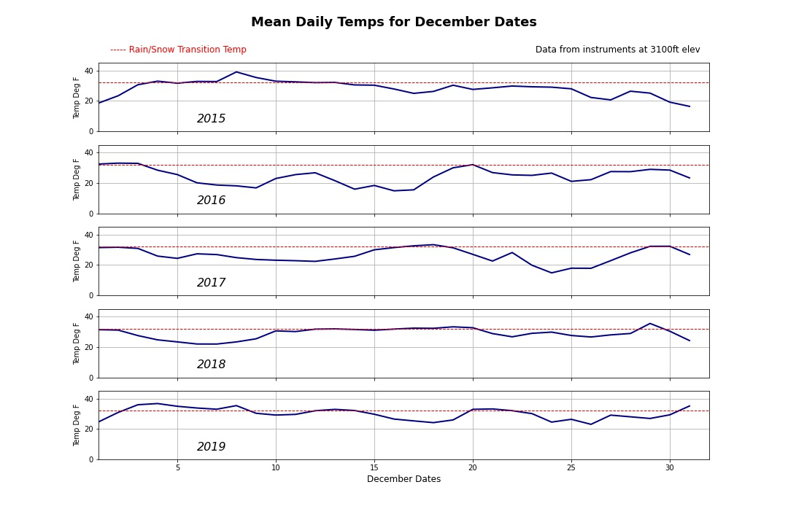

# How is the skiing in December?

## Description
The month of December in Washington State can often be a fickle time with respect to accumulating enough snow for commercial ski operations to get into full swing, and be able to capitalize on the peak holiday season to generate revenue.  Seasoned veterans of the Pacific Northwest skiing community may even be heard grumbling that *"it's hardly worth buying lift tickets in advance during the month of December because the conditions are so variable that sometimes it feels like it rains as much as it snows"*, or *"some years it doesn't snow enough to open a reasonable amount of terrain before the big storms arrive in January or later"*.  This project explores archived weather data recorded from a weather instrument station at one of the most popular ski areas in close proximity to Seattle and Western Washington, Alpental at Snoqualmie Pass. Analyzing this data allows us to get a better picture of how the winter weather shaped ski conditions for that specific venue over a five year period.

## Data Source
The data for this project was downloaded from the archives provided to the public by The Northwest Avalanche Center on their data portal found here:   
<https://www.nwac.us/data-portal/>    

The datasets drawn from this particular location (Alpental Base 3100') include data for:  
 
 - Battery Voltage  
 - Temperature  
 - Relative Humidity  
 - Precipitation  
 - Total Snow Depth  
 - 24hr Snow accumulation  
 Each point is recorded every hour on the hour.

## Usage
As the data fields from each location may differ slightly or include more fields, and instrumentation failures or gitches often present outlier data points, using CSV files from locations other than Alpental Base may require reformatting and additional cleaning.  Providing the columns do not change in the future, subsequent year CSV files from this location should produce consistent results in the code and visualizations as they become available.

### Example of weather instrument stations:

## Exploratory Data Analysis

After importing and cleaning my data using pandas, my first goal was to investigate where daily average temperatures lie with relation to the transition point value of 32 degrees Fahrenheit, below which precipitation falls as some form of snow rather than rain. The graphs below show that daily temperature means often straddle that critical transition line much of the time for the month of December each year.

While this provides insights as to how often the temperatue was conducive to producing snow, it does not address the factor of whether or not meausurable precipitation was happening when the temperature was favorable for snowfall.  This could be further assessed by determining which hourly periods had measurable precipitation for temperatures above and below the transition point, as well as the actual quantities of precipitation measured during those periods. To explore the potential accuracy/inaccuracy of the claim *"It rains as much as it snows at Alpental in December"*, I set up a basic t-test to ascertain if it is acceptable to hold or reject this as a hypothesis.
